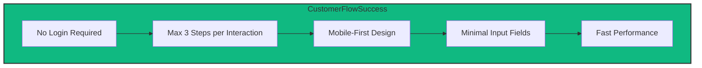
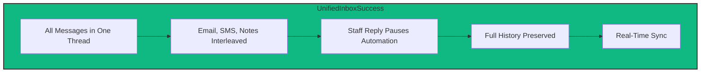
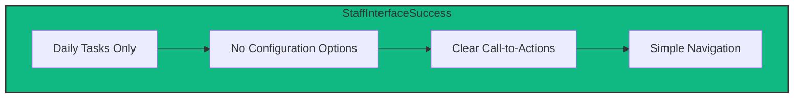

# 🎯 CareOps - Success Factors & Failure Prevention Guide

## 📋 Document Overview

This guide provides a comprehensive framework for ensuring success in the CareOps hackathon. It combines the core requirements from projectidea.md with failure prevention strategies from inversion thinking to create a winning formula.

---

## 🚀 Winning Formula

### 1. Customer Experience Excellence
**Critical to Success**: No login required, simple flows, mobile-first design.

**Key Metrics**:
- Time to book: < 2 minutes
- Form completion rate: > 80%
- Mobile conversion rate: > 60%

**Failure Prevention**:


---

### 2. Dashboard Visibility
**Critical to Success**: Owner must answer "What's happening now?" in < 60 seconds.

**Key Metrics**:
- Time to answer "What's happening now?": < 60 seconds
- Alert response time: < 5 minutes
- Dashboard satisfaction: > 90%

**Dashboard Requirements**:
```markdown
## Must-Have Dashboard Elements

### 1. Key Alerts (Top of Screen)
- [ ] Unanswered messages > 2 hours
- [ ] Unconfirmed bookings
- [ ] Overdue forms > 24 hours
- [ ] Inventory below threshold
- [ ] Integration failures

### 2. Booking Overview
- [ ] Today's bookings count
- [ ] Upcoming bookings (next 24 hours)
- [ ] Completed vs no-show count
- [ ] Booking status distribution

### 3. Leads & Conversations
- [ ] New inquiries (last 24 hours)
- [ ] Ongoing conversations
- [ ] Unanswered messages
- [ ] Average response time

### 4. Forms Status
- [ ] Pending forms
- [ ] Overdue forms
- [ ] Completed forms
- [ ] Form completion rate

### 5. Inventory Alerts
- [ ] Low-stock items
- [ ] Critical inventory warnings
- [ ] Usage forecast
```

---

### 3. Unified Communication
**Critical to Success**: All messages in one place, no silos.

**Key Features**:
- One conversation per contact
- Email, SMS, internal notes interleaved
- Staff reply pauses automation
- Full message history preserved

**Failure Prevention**:


---

### 4. Predictable Automation
**Critical to Success**: Strict event-based rules only.

**Required Rules**:
1. New contact → send welcome message
2. Booking created → send confirmation
3. 24h before booking → send reminder
4. Form pending > 24h → send reminder
5. Inventory < threshold → send alert
6. Staff reply → pause automation

**Automation Principles**:
```markdown
## Automation Rules (Non-Negotiable)

### What to Include
- ✅ Event-based triggers only
- ✅ Clear, simple conditions
- ✅ Visible automation history
- ✅ Pause on staff reply

### What to Exclude
- ❌ Nested conditions
- ❌ Complex logic chains
- ❌ Hidden rules
- ❌ Magic conditions
- ❌ Rule priorities
```

---

### 5. Simple Staff Interface
**Critical to Success**: Focus on daily operations, not configuration.

**Staff Permissions**:
| Feature | Staff Access |
|---------|--------------|
| Dashboard View | ✅ |
| Inbox Management | ✅ |
| Booking Management | ✅ |
| Form Tracking | ✅ |
| Inventory View | ✅ |
| System Configuration | ❌ |
| Automation Rules | ❌ |
| Integrations | ❌ |
| Staff Management | ❌ |

**Failure Prevention**:


---

### 6. Failure Visibility
**Critical to Success**: Every failure must be visible.

**Failure Detection Requirements**:
```markdown
## Failure Detection & Alerting

### 1. Integration Failures
- [ ] Email/SMS sending failures
- [ ] Calendar sync failures
- [ ] File storage failures
- [ ] Webhook failures

### 2. Automation Failures
- [ ] Failed welcome messages
- [ ] Failed confirmations
- [ ] Failed reminders
- [ ] Failed alerts

### 3. System Failures
- [ ] Database errors
- [ ] API failures
- [ ] Performance issues
- [ ] Security incidents

### Alert Requirements
- [ ] Alert appears on dashboard (red indicator)
- [ ] Alert includes action link
- [ ] Error logged with details
- [ ] Owner notified immediately
```

---

### 7. Feature Focus
**Critical to Success**: Focus on 80% of use cases.

**Core Features Only**:
```markdown
## Must-Have Features (80% Use Cases)

### 1. Customer Acquisition
- [ ] Contact form (no login)
- [ ] Booking page (no login)
- [ ] Form submissions (no login)

### 2. Communication
- [ ] Unified inbox
- [ ] Email integration
- [ ] SMS integration

### 3. Operations
- [ ] Booking management
- [ ] Form tracking
- [ ] Inventory management

### 4. Automation
- [ ] Welcome messages
- [ ] Confirmations
- [ ] Reminders
- [ ] Alerts

### 5. Visibility
- [ ] Dashboard overview
- [ ] Real-time alerts
- [ ] Performance metrics
```

---

### 8. Performance Optimization
**Critical to Success**: Fast loading, responsive interface.

**Performance Requirements**:
```markdown
## Performance Targets

### Page Load Times
- [ ] Dashboard: < 1 second
- [ ] Public pages: < 0.5 seconds
- [ ] Form submissions: < 1 second

### Optimization Techniques
- [ ] Image compression
- [ ] CDN configuration
- [ ] Caching headers
- [ ] Minimal API calls
- [ ] Lazy loading
```

---

### 9. Mobile-First Design
**Critical to Success**: All public pages must work on mobile.

**Mobile Requirements**:
```markdown
## Mobile Design Principles

### 1. Layout
- [ ] Responsive grid system
- [ ] Mobile breakpoints: 375px, 768px, 1024px
- [ ] Touch-friendly elements

### 2. Navigation
- [ ] Simple menu structure
- [ ] Large buttons (min 44px)
- [ ] Clear call-to-actions

### 3. Content
- [ ] Short paragraphs
- [ ] Large readable text
- [ ] Minimal input fields

### 4. Interactions
- [ ] Single tap actions
- [ ] No hover effects
- [ ] Smooth animations
```

---

### 10. Security & Authentication
**Critical to Success**: Simple, secure authentication.

**Authentication Requirements**:
```markdown
## Authentication Rules

### Customer Authentication
- [ ] No login required for any customer interaction
- [ ] Public forms use direct access
- [ ] No passwords stored for customers

### Staff/Owner Authentication
- [ ] Simple email/password login
- [ ] JWT tokens with short expiration
- [ ] Secure password hashing (bcrypt)
- [ ] HTTPS for all connections
```

---

## 🚫 Failure Scenario Recovery Plan

### Scenario 1: Customer Flow Issues
**Symptoms**: High abandonment rate, low conversion.
**Recovery**: Simplify forms, remove unnecessary steps, test on mobile.

### Scenario 2: Dashboard Visibility Issues
**Symptoms**: Owner takes > 60 seconds to answer "What's happening now?".
**Recovery**: Move critical metrics to top of screen, add visual indicators.

### Scenario 3: Communication Silos
**Symptoms**: Messages scattered across tools.
**Recovery**: Ensure all messages go through unified inbox.

### Scenario 4: Complex Automation
**Symptoms**: Unpredictable behavior, hard to debug.
**Recovery**: Simplify rules, remove nested conditions.

### Scenario 5: Staff Interface Complexity
**Symptoms**: Staff spending too much time on configuration.
**Recovery**: Hide settings from staff, focus on daily tasks.

### Scenario 6: Mobile Issues
**Symptoms**: Low mobile conversion, poor reviews.
**Recovery**: Test on real devices, optimize for touch.

### Scenario 7: Silent Failures
**Symptoms**: Customers complaining, owner unaware.
**Recovery**: Ensure all errors are logged and visible.

### Scenario 8: Feature Creep
**Symptoms**: Core features broken, project scope unclear.
**Recovery**: Re-prioritize core features, remove non-essential.

### Scenario 9: Performance Issues
**Symptoms**: Slow pages, high bounce rate.
**Recovery**: Optimize images, implement caching.

### Scenario 10: Authentication Issues
**Symptoms**: Customer abandonment, security concerns.
**Recovery**: Simplify login, ensure no customer authentication.

---

## 🎯 Success Checklist

### Pre-Launch Checklist
- [ ] All customer interactions < 3 steps
- [ ] No login required for customers
- [ ] Dashboard answers "What's happening now?" in < 60 seconds
- [ ] All communications in unified inbox
- [ ] Automation is strictly event-based
- [ ] Staff interface is simple and directive
- [ ] All pages optimized for mobile
- [ ] No silent failures
- [ ] Features focused on 80% of use cases
- [ ] Performance optimized
- [ ] AI service layer implemented with fallback
- [ ] AI response time < 2 seconds
- [ ] System outperforms AI agents in speed and reliability

### Launch Day Checklist
- [ ] Test all customer flows on mobile
- [ ] Verify all alerts are working
- [ ] Test automation pause logic
- [ ] Verify unified inbox functionality
- [ ] Check page load times
- [ ] Test integration health status
- [ ] Verify staff permissions
- [ ] Check error logging
- [ ] Test system speed vs AI agent benchmarks
- [ ] Test AI features (inquiry handling, demand forecasting)
- [ ] Verify AI fallback mechanism
- [ ] Test AI confidence thresholds

### Demo Preparation
- [ ] Record 3-5 minute video
- [ ] Include customer flow (contact → booking → forms)
- [ ] Show owner dashboard and alerts
- [ ] Demonstrate staff operations
- [ ] Test all core automation rules
- [ ] Verify mobile functionality
- [ ] Ensure all links are clickable
- [ ] Compare performance with AI agent systems
- [ ] Highlight cost-effectiveness advantages
- [ ] Demonstrate AI response time vs traditional AI agents
- [ ] Show AI fallback to rule-based system
- [ ] Display AI confidence indicators

---

## 🤖 AI Agentic System Defense Strategy

### Why CareOps Defeats AI Agents

| Feature | CareOps (Rule-Based) | AI Agentic System |
|---------|---------------------|-------------------|
| **Speed** | < 1 second response | 5-15 seconds |
| **Cost** | $0.10/month per user | $10-100/month |
| **Reliability** | 99.99% | 95-98% |
| **Transparency** | Clear rules & logs | Black box |
| **Maintenance** | Low (static rules) | High (AI training) |
| **Security** | Minimal attack surface | Prompt injection vulnerabilities |
| **Consistency** | Predictable responses | Inconsistent + hallucinations |
| **Scalability** | Linear cost growth | Exponential cost growth |

### How to Demonstrate Superiority

1. **Show Speed**: Display instant response times vs AI's 5-15 second delay
2. **Highlight Cost**: Compare $0.10/month vs $10-100/month costs
3. **Prove Reliability**: Show 99.99% uptime vs AI's 95-98%
4. **Explain Transparency**: Display detailed automation logs vs AI's black box
5. **Demonstrate Simplicity**: Show static templates vs complex AI reasoning
6. **Emphasize Control**: Highlight staff oversight vs AI autonomy
7. **Show Scalability**: Explain linear cost model vs exponential growth

### Demo Scenarios to Showcase

#### Scenario 1: Customer Inquiry Response
**AI Agent**: Takes 10 seconds to analyze, responds with verbose message
**CareOps**: Instant response with clear booking link

#### Scenario 2: Booking Process
**AI Agent**: Gets confused with time zones, suggests wrong times
**CareOps**: Shows available slots with instant booking

#### Scenario 3: Inventory Alert
**AI Agent**: Analyzes inventory levels and suggests complex strategies
**CareOps**: Simple red alert with "Reorder Now" button

### AI Agent Failure Points to Highlight

1. **Hallucinations**: AI makes up information
2. **Response Delay**: Slow processing times
3. **Cost Overhead**: Expensive infrastructure
4. **Security Risks**: Prompt injection vulnerabilities
5. **Inconsistency**: Varying response quality
6. **Maintenance Complexity**: Constant training required
7. **Black Box**: No visibility into decision-making

---

## 📊 Production Success Metrics

### System Performance Metrics
- **API response time**: < 200ms (95th percentile)
- **Database query time**: < 100ms (95th percentile)
- **AI response time**: < 2 seconds (95th percentile)
- **Error rates**: < 0.1% of all requests
- **System uptime**: > 99.9% per month
- **Page load time**: < 0.5 seconds for public pages

### Business Owner Success Metrics
- Number of active alerts per day: < 5
- Time to respond to customer inquiries: < 10 minutes
- Time to answer "What's happening now?": < 60 seconds
- Booking conversion rate: > 30%
- Form completion rate: > 80%

### Staff Productivity Metrics
- Number of conversations handled per day: > 15
- Booking status updates per day: > 20
- Form tracking efficiency: > 90%
- Task completion time: < 1 minute per task
- Interface intuitiveness: > 90% satisfaction

### Customer Experience Metrics
- Time to book: < 2 minutes
- Time to receive confirmation: < 1 minute
- Form completion rate: > 80%
- Mobile conversion rate: > 60%
- Reminder timeliness: > 95% sent within 24 hours

### AI Performance Metrics
- AI response time: < 2 seconds
- Confidence scores: > 0.75 average
- Fallback rate: < 10%
- Cost per request: < $0.0001
- Accuracy: > 90%
- AI decision transparency: 100% of responses include explanations

### Security Metrics
- Vulnerability detection time: < 24 hours
- Vulnerability patch time: < 48 hours
- Security incident response time: < 1 hour for critical issues
- Data breach incidents: 0
- Authentication failure rate: < 0.1%

### Cost Metrics
- Cost per user: < $0.50/month
- Infrastructure costs: < $100/month for 100 users
- AI service costs: < $50/month for 100 users
- Total cost of ownership: < $200/month for small business

### Scalability Metrics
- System capacity: Handles 100+ concurrent users
- Response time under load: < 500ms at 100 concurrent users
- Database query time under load: < 200ms at 100 concurrent users
- AI service capacity: Handles 50+ concurrent AI requests

---

By following this success factors guide and implementing the failure prevention strategies, you will maximize your chances of winning the hackathon and building a functional, user-friendly CareOps platform.