# 🔄 CareOps - Business Workflows

## 📋 Document Overview (Built on First Principles)

This document outlines the key business workflows for **CareOps**, following the **First Principles Thinking** and **Inversion** framework from `.clinerule.md`. It covers all user roles, customer interactions, and system processes, focusing on solving the core problem of **tool chaos** in service businesses.

### Guiding Principles for Workflows
1. **Simplicity Over Complexity**: One system, not many tools
2. **Visibility First**: Dashboard answers "What's happening now?" in < 1 minute
3. **Zero Friction for Customers**: No-login interactions via forms/links/messages
4. **Predictable Automation**: Strict event-based rules only
5. **Staff Empowerment**: Clear role separation (Owner vs Staff)

All workflows are designed to avoid common pitfalls (inversion thinking) and focus on creating a unified, predictable system.

---

## 👥 User Roles

### 1. Business Owner (Admin)
- **Purpose**: Set up and monitor the business
- **Permissions**: Full access to all features
- **Key Actions**: Create workspace, configure integrations, invite staff, view dashboard

### 2. Staff User
- **Purpose**: Execute daily operations
- **Permissions**: Manage inbox, bookings, forms, view inventory
- **Key Actions**: Reply to customers, update booking status, track forms

### 3. Customer (No Login)
- **Purpose**: Interact with the business
- **Permissions**: Submit forms, book services
- **Key Actions**: Fill contact form, book appointments, complete forms

---

## 🚀 Core Workflows

### 1. Workspace Onboarding (Business Owner)

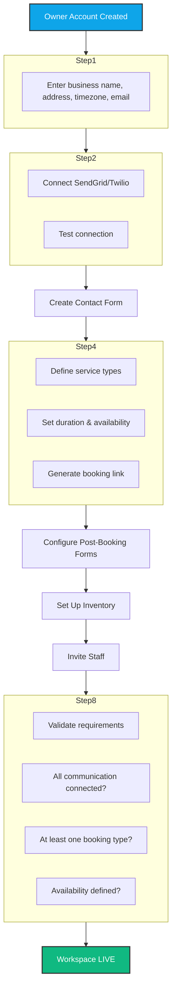
```mermaid
flowchart TD
    Start[Owner Account Created] --> Step1[Create Workspace]
    Step1 --> Step2[Connect Email & SMS]
    Step2 --> Step3[Create Contact Form]
    Step3 --> Step4[Set Up Bookings]
    Step4 --> Step5[Configure Post-Booking Forms]
    Step5 --> Step6[Set Up Inventory]
    Step6 --> Step7[Invite Staff]
    Step7 --> Step8[Validate & Activate]
    Step8 --> Live[Workspace LIVE]
    
    subgraph Step1
        A[Enter business name, address, timezone, email]
    end
    
    subgraph Step2
        B[Connect SendGrid/Twilio]
        C[Test connection]
    end
    
    subgraph Step4
        D[Define service types]
        E[Set duration & availability]
        F[Generate booking link]
    end
    
    subgraph Step8
        G[Validate requirements]
        H[All communication connected?]
        I[At least one booking type?]
        J[Availability defined?]
    end
    
    style Start fill:#0EA5E9,stroke:#333,stroke-width:2px,color:#fff
    style Live fill:#10B981,stroke:#333,stroke-width:2px,color:#fff
```

**Key Rules**:
- At least one communication channel mandatory (email or SMS)
- Workspace not active until all required steps completed
- All data encrypted and stored securely

---

### 2. Customer Journey - Contact First

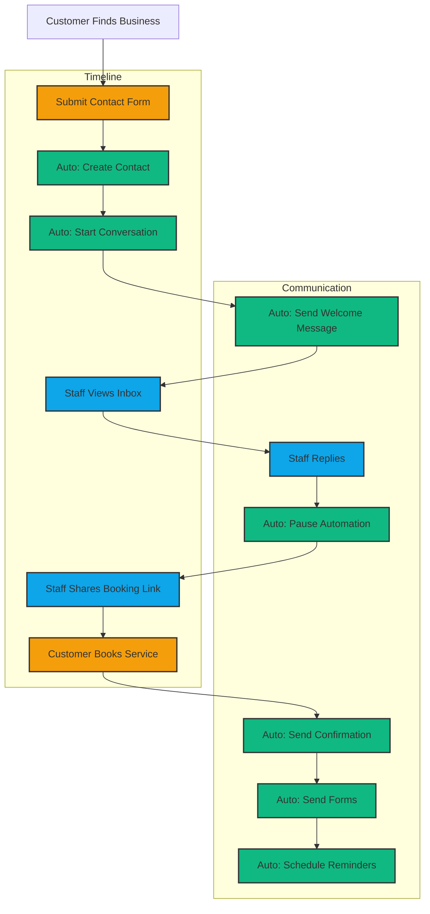
```mermaid
flowchart TD
    Start[Customer Finds Business] --> ContactForm[Submit Contact Form]
    ContactForm --> Auto1[Auto: Create Contact]
    Auto1 --> Auto2[Auto: Start Conversation]
    Auto2 --> Auto3[Auto: Send Welcome Message]
    Auto3 --> Inbox[Staff Views Inbox]
    Inbox --> Reply[Staff Replies]
    Reply --> Auto4[Auto: Pause Automation]
    Auto4 --> Share[Staff Shares Booking Link]
    Share --> Booking[Customer Books Service]
    Booking --> Auto5[Auto: Send Confirmation]
    Auto5 --> Auto6[Auto: Send Forms]
    Auto6 --> Auto7[Auto: Schedule Reminders]
    
    subgraph Communication
        Auto3
        Reply
        Auto4
        Auto5
        Auto6
        Auto7
    end
    
    subgraph Timeline
        ContactForm:::new
        Auto1:::auto
        Auto2:::auto
        Auto3:::auto
        Inbox:::staff
        Reply:::staff
        Auto4:::auto
        Share:::staff
        Booking:::new
        Auto5:::auto
        Auto6:::auto
        Auto7:::auto
    end
    
    classDef new fill:#F59E0B,stroke:#333,stroke-width:2px
    classDef auto fill:#10B981,stroke:#333,stroke-width:2px
    classDef staff fill:#0EA5E9,stroke:#333,stroke-width:2px
```

**Key Features**:
- One conversation per contact
- Full message history preserved
- Staff reply pauses automation for that thread

---

### 3. Customer Journey - Book First

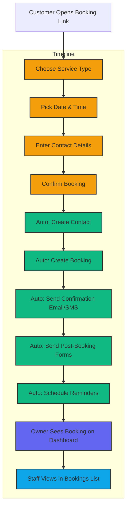
```mermaid
flowchart TD
    Start[Customer Opens Booking Link] --> Select[Choose Service Type]
    Select --> Date[Pick Date & Time]
    Date --> Contact[Enter Contact Details]
    Contact --> Submit[Confirm Booking]
    Submit --> Auto1[Auto: Create Contact]
    Auto1 --> Auto2[Auto: Create Booking]
    Auto2 --> Auto3[Auto: Send Confirmation Email/SMS]
    Auto3 --> Auto4[Auto: Send Post-Booking Forms]
    Auto4 --> Auto5[Auto: Schedule Reminders]
    Auto5 --> Dashboard[Owner Sees Booking on Dashboard]
    Dashboard --> Staff[Staff Views in Bookings List]
    
    subgraph Timeline
        Select:::new
        Date:::new
        Contact:::new
        Submit:::new
        Auto1:::auto
        Auto2:::auto
        Auto3:::auto
        Auto4:::auto
        Auto5:::auto
        Dashboard:::owner
        Staff:::staff
    end
    
    classDef new fill:#F59E0B,stroke:#333,stroke-width:2px
    classDef auto fill:#10B981,stroke:#333,stroke-width:2px
    classDef owner fill:#6366f1,stroke:#333,stroke-width:2px
    classDef staff fill:#0EA5E9,stroke:#333,stroke-width:2px
```

**Key Rules**:
- No login required
- Booking link publicly accessible
- Customer receives instant confirmation

---

### 4. Staff Daily Operations

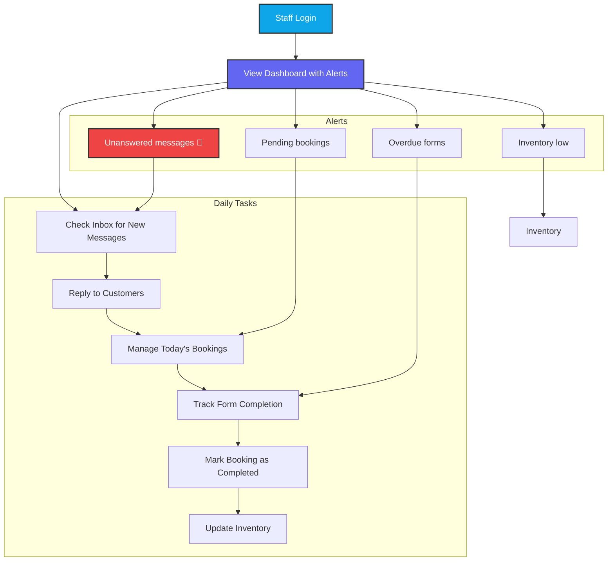
```mermaid
flowchart TD
    Start[Staff Login] --> Dashboard[View Dashboard with Alerts]
    Dashboard --> Inbox[Check Inbox for New Messages]
    Inbox --> Reply[Reply to Customers]
    Reply --> Bookings[Manage Today's Bookings]
    Bookings --> Forms[Track Form Completion]
    Forms --> Complete[Mark Booking as Completed]
    Complete --> Update[Update Inventory]
    
    subgraph Daily Tasks
        Inbox
        Reply
        Bookings
        Forms
        Complete
        Update
    end
    
    subgraph Alerts
        A[Unanswered messages 🔴]
        B[Pending bookings]
        C[Overdue forms]
        D[Inventory low]
    end
    
    Dashboard --> A
    Dashboard --> B
    Dashboard --> C
    Dashboard --> D
    
    A --> Inbox
    B --> Bookings
    C --> Forms
    D --> Inventory
    
    style Start fill:#0EA5E9,stroke:#333,stroke-width:2px,color:#fff
    style Dashboard fill:#6366f1,stroke:#333,stroke-width:2px,color:#fff
    style A fill:#EF4444,stroke:#333,stroke-width:2px,color:#fff
```

**Key Limitations for Staff**:
- Cannot change system configuration
- Cannot modify automation rules
- Cannot manage integrations
- Can only view, not update, inventory

---

### 5. Form Management & Tracking

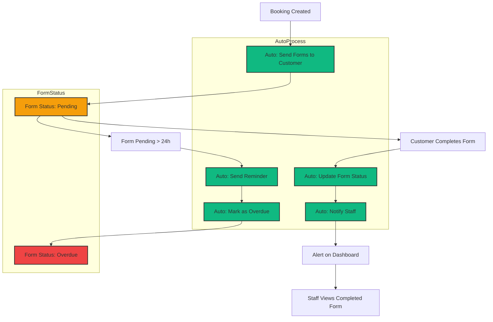
```mermaid
flowchart TD
    Start[Booking Created] --> Auto1[Auto: Send Forms to Customer]
    Auto1 --> Pending[Form Status: Pending]
    Pending --> Customer[Customer Completes Form]
    Customer --> Auto2[Auto: Update Form Status]
    Auto2 --> Auto3[Auto: Notify Staff]
    Auto3 --> Dashboard[Alert on Dashboard]
    Dashboard --> Staff[Staff Views Completed Form]
    
    Pending --> Timeout[Form Pending > 24h]
    Timeout --> Auto4[Auto: Send Reminder]
    Auto4 --> Auto5[Auto: Mark as Overdue]
    Auto5 --> Overdue[Form Status: Overdue]
    
    subgraph AutoProcess
        Auto1:::auto
        Auto2:::auto
        Auto3:::auto
        Auto4:::auto
        Auto5:::auto
    end
    
    subgraph FormStatus
        Pending:::pending
        Overdue:::overdue
        Auto3:::completed
    end
    
    classDef auto fill:#10B981,stroke:#333,stroke-width:2px
    classDef pending fill:#F59E0B,stroke:#333,stroke-width:2px
    classDef overdue fill:#EF4444,stroke:#333,stroke-width:2px
    classDef completed fill:#10B981,stroke:#333,stroke-width:2px
```

**Key Features**:
- Auto-send forms after booking
- Form completion tracking
- Overdue form reminders
- Dashboard alerts for pending/overdue forms

---

### 6. Inventory Management

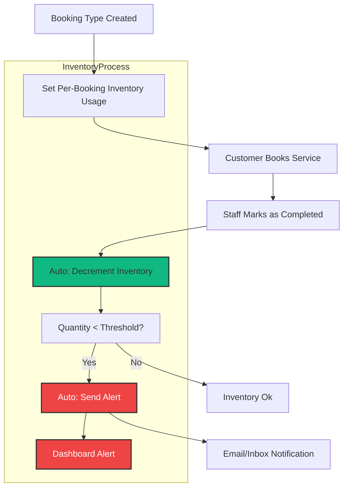
```mermaid
flowchart TD
    Start[Booking Type Created] --> Inventory[Set Per-Booking Inventory Usage]
    Inventory --> Booking[Customer Books Service]
    Booking --> Complete[Staff Marks as Completed]
    Complete --> Auto1[Auto: Decrement Inventory]
    Auto1 --> Check[Quantity < Threshold?]
    Check -->|Yes| Alert[Auto: Send Alert]
    Alert --> Dashboard[Dashboard Alert]
    Check -->|No| Ok[Inventory Ok]
    
    subgraph InventoryProcess
        Inventory
        Auto1
        Check
        Alert
        Dashboard
    end
    
    Alert --> Staff[Email/Inbox Notification]
    
    style Alert fill:#EF4444,stroke:#333,stroke-width:2px,color:#fff
    style Dashboard fill:#EF4444,stroke:#333,stroke-width:2px,color:#fff
    style Auto1 fill:#10B981,stroke:#333,stroke-width:2px
```

**Key Rules**:
- Inventory only updated when booking marked as completed
- Alerts sent when quantity drops below configured threshold
- Threshold configurable per item
- Usage per booking configurable per service

---

### 7. Business Owner Dashboard Monitoring

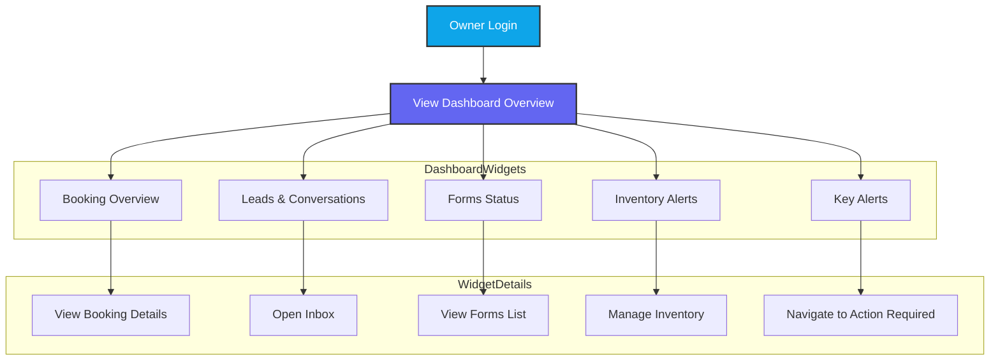
```mermaid
flowchart TD
    Start[Owner Login] --> Dashboard[View Dashboard Overview]
    
    subgraph DashboardWidgets
        A[Booking Overview]
        B[Leads & Conversations]
        C[Forms Status]
        D[Inventory Alerts]
        E[Key Alerts]
    end
    
    Dashboard --> A
    Dashboard --> B
    Dashboard --> C
    Dashboard --> D
    Dashboard --> E
    
    A --> Bookings[View Booking Details]
    B --> Inbox[Open Inbox]
    C --> Forms[View Forms List]
    D --> Inventory[Manage Inventory]
    E --> Action[Navigate to Action Required]
    
    subgraph WidgetDetails
        Bookings
        Inbox
        Forms
        Inventory
        Action
    end
    
    style Start fill:#0EA5E9,stroke:#333,stroke-width:2px,color:#fff
    style Dashboard fill:#6366f1,stroke:#333,stroke-width:2px,color:#fff
```

**Dashboard Metrics**:
1. **Booking Overview**: Today's bookings, upcoming, completed vs no-show
2. **Leads & Conversations**: New inquiries, ongoing, unanswered
3. **Forms Status**: Pending, overdue, completed
4. **Inventory Alerts**: Low-stock items, critical warnings
5. **Key Alerts**: Missed messages, unconfirmed bookings, overdue forms

---

### 8. Automation Rules

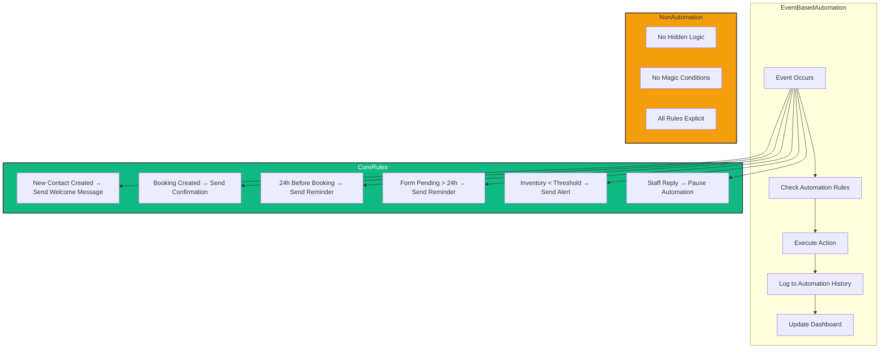
```mermaid
flowchart TD
    subgraph EventBasedAutomation
        Start[Event Occurs] --> Rule[Check Automation Rules]
        Rule --> Action[Execute Action]
        Action --> Log[Log to Automation History]
        Log --> Monitor[Update Dashboard]
    end
    
    subgraph CoreRules
        CR1[New Contact Created → Send Welcome Message]
        CR2[Booking Created → Send Confirmation]
        CR3[24h Before Booking → Send Reminder]
        CR4[Form Pending > 24h → Send Reminder]
        CR5[Inventory < Threshold → Send Alert]
        CR6[Staff Reply → Pause Automation]
    end
    
    subgraph NonAutomation
        NA1[No Hidden Logic]
        NA2[No Magic Conditions]
        NA3[All Rules Explicit]
    end
    
    Start --> CR1
    Start --> CR2
    Start --> CR3
    Start --> CR4
    Start --> CR5
    Start --> CR6
    
    style CoreRules fill:#10B981,stroke:#333,stroke-width:2px,color:#fff
    style NonAutomation fill:#F59E0B,stroke:#333,stroke-width:2px
```

**Automation Principles**:
- **Strict event-based only**: No scheduled or random triggers
- **Predictable**: Rules clearly documented and visible
- **Transparent**: Full automation history available
- **Pausable**: Staff reply pauses automation for that conversation

---

### 9. Integration Management

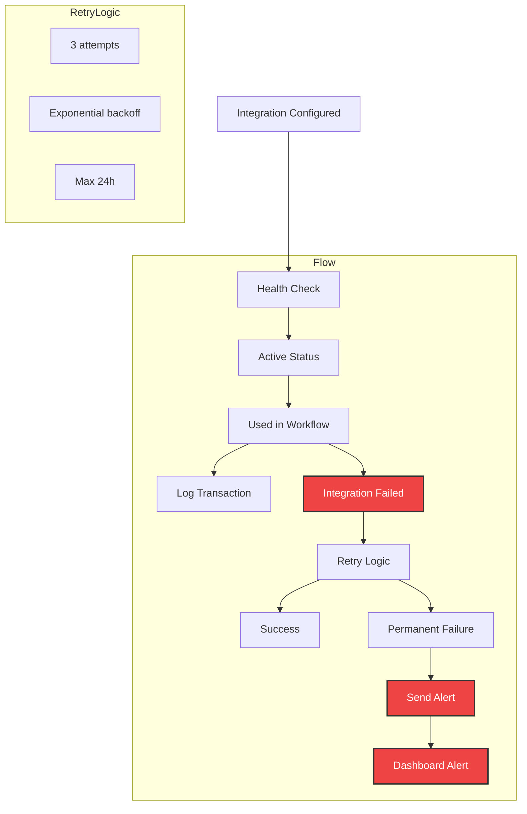
```mermaid
flowchart TD
    Start[Integration Configured] --> Health[Health Check]
    Health --> Status[Active Status]
    Status --> Use[Used in Workflow]
    Use --> Log[Log Transaction]
    
    Use --> Error[Integration Failed]
    Error --> Retry[Retry Logic]
    Retry --> Success[Success]
    Retry --> Fail[Permanent Failure]
    Fail --> Alert[Send Alert]
    Alert --> Dashboard[Dashboard Alert]
    
    subgraph Flow
        Health
        Status
        Use
        Log
        Error
        Retry
        Success
        Fail
        Alert
        Dashboard
    end
    
    subgraph RetryLogic
        R1[3 attempts]
        R2[Exponential backoff]
        R3[Max 24h]
    end
    
    style Error fill:#EF4444,stroke:#333,stroke-width:2px,color:#fff
    style Alert fill:#EF4444,stroke:#333,stroke-width:2px,color:#fff
    style Dashboard fill:#EF4444,stroke:#333,stroke-width:2px,color:#fff
```

**Required Integrations**:
1. **Email**: SendGrid or AWS SES
2. **SMS**: Twilio
3. **Calendar**: Google Calendar
4. **File Storage**: AWS S3 or Cloudinary
5. **Webhooks**: HTTP endpoints

---

## 📊 Dashboard Alert Types & Actions

| Alert Type | Trigger | Dashboard Widget | Action Required |
|------------|---------|------------------|-----------------|
| **Missed Message** | Unanswered message > 2h | Key Alerts | Open conversation & reply |
| **Unconfirmed Booking** | Booking created but no confirmation sent | Key Alerts | Check booking details |
| **Overdue Form** | Form pending > 24h | Key Alerts | Send reminder or follow up |
| **Low Inventory** | Quantity < threshold | Inventory Alerts | Restock inventory |
| **Integration Error** | External service failure | Key Alerts | Check integration settings |
| **No-show Booking** | Customer didn't attend | Booking Overview | Update booking status |

---

## 🛠️ System Maintenance Workflows

### 1. Workspace Deactivation

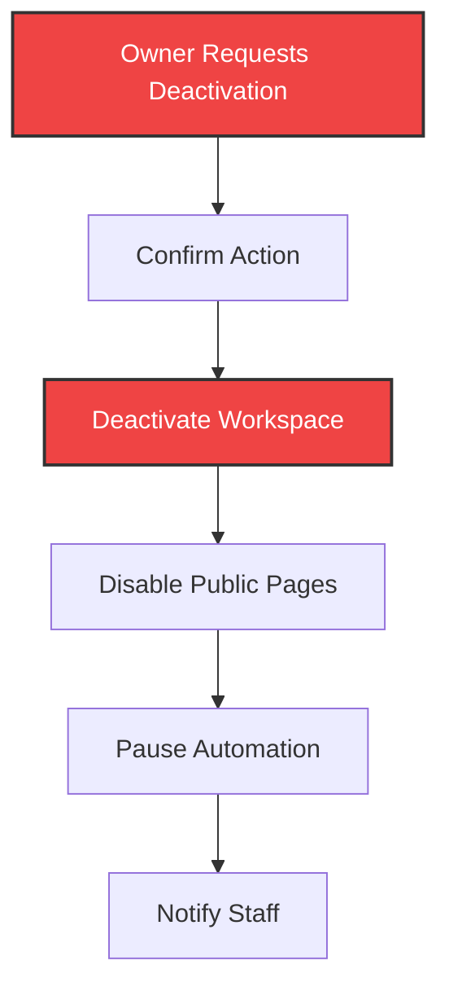
```mermaid
flowchart TD
    Start[Owner Requests Deactivation] --> Confirm[Confirm Action]
    Confirm --> Deactivate[Deactivate Workspace]
    Deactivate --> Disable[Disable Public Pages]
    Disable --> Pause[Pause Automation]
    Pause --> Notify[Notify Staff]
    
    style Start fill:#EF4444,stroke:#333,stroke-width:2px,color:#fff
    style Deactivate fill:#EF4444,stroke:#333,stroke-width:2px,color:#fff
```

### 2. Data Export/Backup

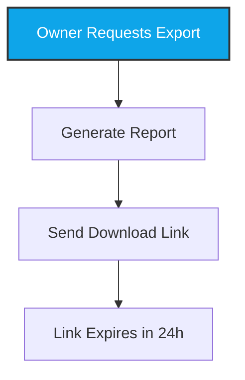
```mermaid
flowchart TD
    Start[Owner Requests Export] --> Generate[Generate Report]
    Generate --> Email[Send Download Link]
    Email --> Expire[Link Expires in 24h]
    
    style Start fill:#0EA5E9,stroke:#333,stroke-width:2px,color:#fff
```

---

## 🎯 Success Metrics

### Business Owner Success
- Number of active alerts per day
- Time to respond to customer inquiries
- Booking conversion rate
- Form completion rate

### Staff Productivity
- Number of conversations handled per day
- Booking status updates per day
- Form tracking efficiency

### Customer Experience
- Time to receive confirmation
- Form completion rate
- Reminder timeliness

---

## 🚀 Production Monitoring Workflows

### 1. System Performance Monitoring

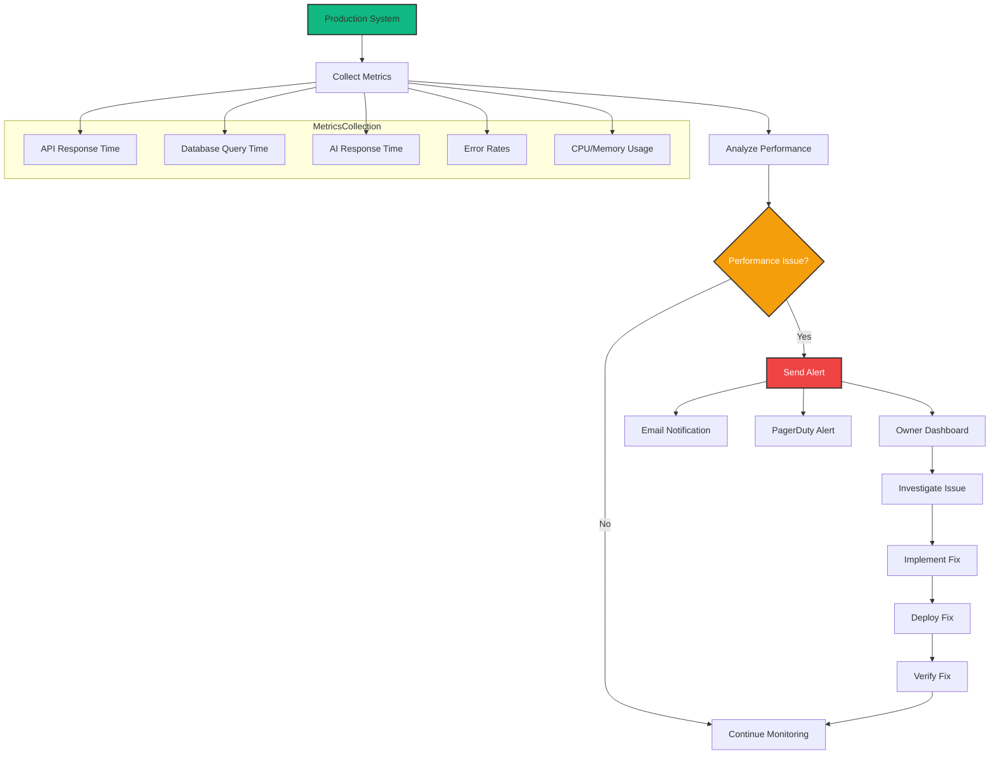
```mermaid
flowchart TD
    Start[Production System] --> Metrics[Collect Metrics]
    Metrics --> Analyze[Analyze Performance]
    Analyze --> Alert{Performance Issue?}
    
    Alert -->|Yes| Notify[Send Alert]
    Notify --> Owner[Owner Dashboard]
    Notify --> Email[Email Notification]
    Notify --> Pager[PagerDuty Alert]
    
    Alert -->|No| Continue[Continue Monitoring]
    
    Owner --> Investigate[Investigate Issue]
    Investigate --> Fix[Implement Fix]
    Fix --> Deploy[Deploy Fix]
    Deploy --> Verify[Verify Fix]
    Verify --> Continue
    
    subgraph MetricsCollection
        M1[API Response Time]
        M2[Database Query Time]
        M3[AI Response Time]
        M4[Error Rates]
        M5[CPU/Memory Usage]
    end
    
    Metrics --> M1
    Metrics --> M2
    Metrics --> M3
    Metrics --> M4
    Metrics --> M5
    
    style Start fill:#10B981,stroke:#333,stroke-width:2px
    style Alert fill:#F59E0B,stroke:#333,stroke-width:2px,color:#fff
    style Notify fill:#EF4444,stroke:#333,stroke-width:2px,color:#fff
```

**Key Metrics**:
- API response time: < 200ms
- Database query time: < 100ms
- Groq Llama 3.2 response time: < 2 seconds (ultra-fast inference)
- Error rates: < 0.1%
- CPU usage: < 80%
- Memory usage: < 90%

### 2. AI Performance Monitoring

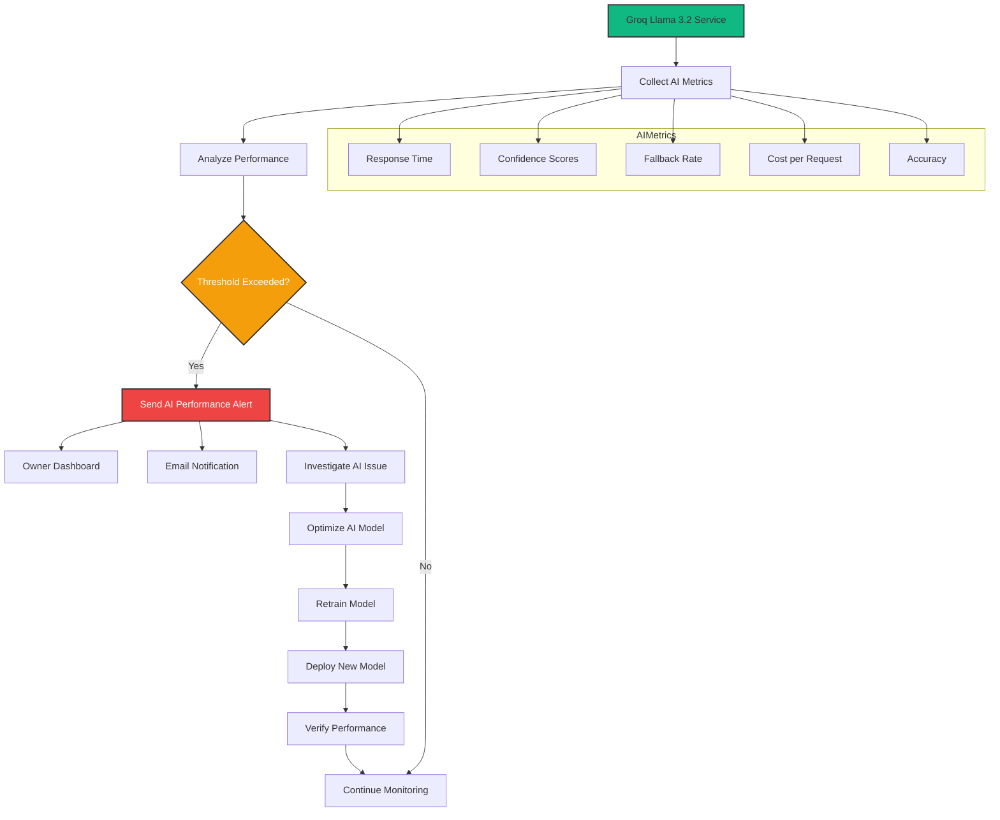
```mermaid
flowchart TD
    Start[Groq Llama 3.2 Service] --> Collect[Collect AI Metrics]
    Collect --> Analyze[Analyze Performance]
    Analyze --> Check{Threshold Exceeded?}
    
    Check -->|Yes| Alert[Send AI Performance Alert]
    Alert --> Dashboard[Owner Dashboard]
    Alert --> Email[Email Notification]
    
    Check -->|No| Continue[Continue Monitoring]
    
    Alert --> Investigate[Investigate AI Issue]
    Investigate --> Optimize[Optimize AI Model]
    Optimize --> Retrain[Retrain Model]
    Retrain --> Deploy[Deploy New Model]
    Deploy --> Verify[Verify Performance]
    Verify --> Continue
    
    subgraph AIMetrics
        AM1[Response Time]
        AM2[Confidence Scores]
        AM3[Fallback Rate]
        AM4[Cost per Request]
        AM5[Accuracy]
    end
    
    Collect --> AM1
    Collect --> AM2
    Collect --> AM3
    Collect --> AM4
    Collect --> AM5
    
    style Start fill:#10B981,stroke:#333,stroke-width:2px
    style Check fill:#F59E0B,stroke:#333,stroke-width:2px,color:#fff
    style Alert fill:#EF4444,stroke:#333,stroke-width:2px,color:#fff
```

**AI Performance Targets**:
- Response time: < 2 seconds (Groq's ultra-fast inference)
- Confidence scores: > 0.75
- Fallback rate: < 10%
- Cost per request: < $0.00001 (Groq's ultra-low pricing)
- Accuracy: > 90%

### 3. Failure Detection & Recovery

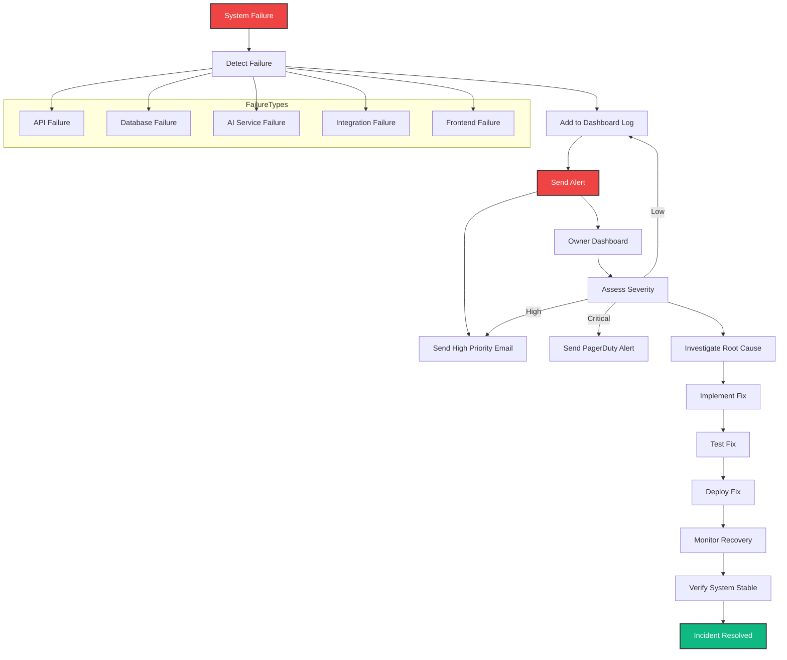
```mermaid
flowchart TD
    Start[System Failure] --> Detect[Detect Failure]
    Detect --> Log[Log Error Details]
    Log --> Alert[Send Alert]
    Alert --> Owner[Owner Dashboard]
    Alert --> Email[Email Notification]
    
    Owner --> Assess[Assess Severity]
    Assess -->|Critical| Pager[Send PagerDuty Alert]
    Assess -->|High| Email[Send High Priority Email]
    Assess -->|Low| Log[Add to Dashboard Log]
    
    Assess --> Investigate[Investigate Root Cause]
    Investigate --> Fix[Implement Fix]
    Fix --> Test[Test Fix]
    Test --> Deploy[Deploy Fix]
    Deploy --> Monitor[Monitor Recovery]
    Monitor --> Verify[Verify System Stable]
    Verify --> Complete[Incident Resolved]
    
    subgraph FailureTypes
        FT1[API Failure]
        FT2[Database Failure]
        FT3[AI Service Failure]
        FT4[Integration Failure]
        FT5[Frontend Failure]
    end
    
    Detect --> FT1
    Detect --> FT2
    Detect --> FT3
    Detect --> FT4
    Detect --> FT5
    
    style Start fill:#EF4444,stroke:#333,stroke-width:2px,color:#fff
    style Alert fill:#EF4444,stroke:#333,stroke-width:2px,color:#fff
    style Complete fill:#10B981,stroke:#333,stroke-width:2px,color:#fff
```

**Recovery Time Objectives (RTO)**:
- Critical failures: < 15 minutes
- High severity: < 30 minutes
- Low severity: < 2 hours

### 4. Security Incident Response

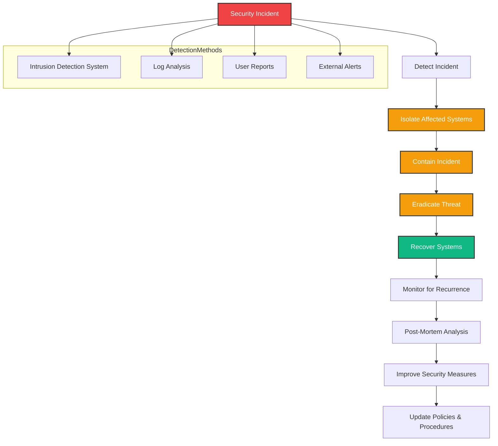
```mermaid
flowchart TD
    Start[Security Incident] --> Detect[Detect Incident]
    Detect --> Isolate[Isolate Affected Systems]
    Isolate --> Contain[Contain Incident]
    Contain --> Eradicate[Eradicate Threat]
    Eradicate --> Recover[Recover Systems]
    Recover --> Monitor[Monitor for Recurrence]
    
    subgraph DetectionMethods
        DM1[Intrusion Detection System]
        DM2[Log Analysis]
        DM3[User Reports]
        DM4[External Alerts]
    end
    
    Start --> DM1
    Start --> DM2
    Start --> DM3
    Start --> DM4
    
    Monitor --> PostMortem[Post-Mortem Analysis]
    PostMortem --> Improve[Improve Security Measures]
    Improve --> Update[Update Policies & Procedures]
    
    style Start fill:#EF4444,stroke:#333,stroke-width:2px,color:#fff
    style Isolate fill:#F59E0B,stroke:#333,stroke-width:2px,color:#fff
    style Contain fill:#F59E0B,stroke:#333,stroke-width:2px,color:#fff
    style Eradicate fill:#F59E0B,stroke:#333,stroke-width:2px,color:#fff
    style Recover fill:#10B981,stroke:#333,stroke-width:2px,color:#fff
```

## 🚀 AI Agentic Workflows (Reliable Implementation with Groq Llama 3.2)

### 1. AI-Powered Customer Inquiry Handling (Groq Llama 3.2)

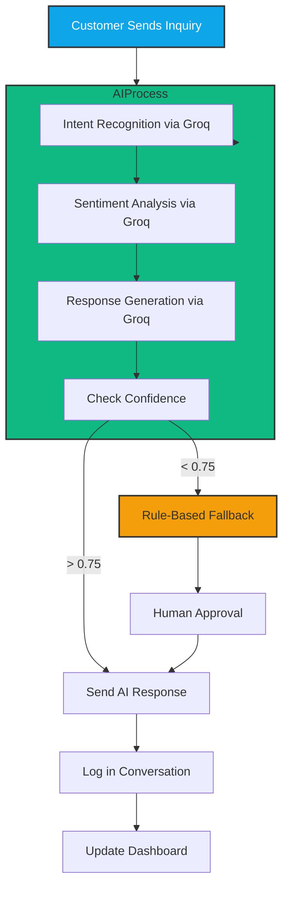
```mermaid
flowchart TD
    Start[Customer Sends Inquiry] --> AIProcess[Groq Llama 3.2 Service Layer]
    AIProcess --> Intent[Intent Recognition via Groq]
    Intent --> Sentiment[Sentiment Analysis via Groq]
    Sentiment --> Response[Response Generation via Groq]
    Response --> Confidence[Check Confidence]
    
    Confidence -->|> 0.75| Send[Send AI Response]
    Send --> Log[Log in Conversation]
    Log --> Dashboard[Update Dashboard]
    
    Confidence -->|< 0.75| Fallback[Rule-Based Fallback]
    Fallback --> Human[Human Approval]
    Human --> Send
    
    subgraph AIProcess
        Intent
        Sentiment
        Response
        Confidence
    end
    
    style Start fill:#0EA5E9,stroke:#333,stroke-width:2px,color:#fff
    style AIProcess fill:#10B981,stroke:#333,stroke-width:2px
    style Fallback fill:#F59E0B,stroke:#333,stroke-width:2px
```

**Key Features**:
- Groq Llama 3.2 analyzes inquiry intent and sentiment with ultra-fast inference
- Response generation with context awareness using Groq API
- Confidence threshold check (0.75 minimum)
- Rule-based fallback for low confidence responses
- Human approval required for high-risk inquiries
- Cost-effective: < $0.00001 per request with Groq

### 2. AI-Driven Demand Forecasting (Groq Llama 3.2)

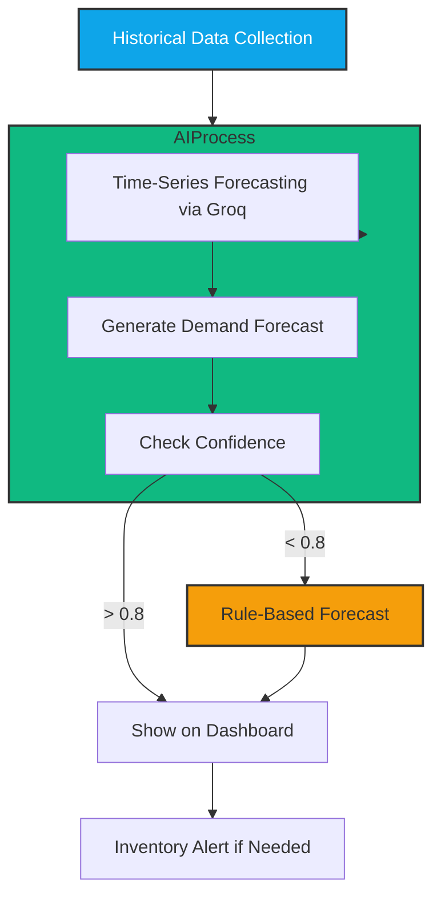
```mermaid
flowchart TD
    Start[Historical Data Collection] --> AIProcess[Groq Llama 3.2 Service Layer]
    AIProcess --> Model[Time-Series Forecasting via Groq]
    Model --> Forecast[Generate Demand Forecast]
    Forecast --> Confidence[Check Confidence]
    
    Confidence -->|> 0.8| Display[Show on Dashboard]
    Display --> Alert[Inventory Alert if Needed]
    
    Confidence -->|< 0.8| Fallback[Rule-Based Forecast]
    Fallback --> Display
    
    subgraph AIProcess
        Model
        Forecast
        Confidence
    end
    
    style Start fill:#0EA5E9,stroke:#333,stroke-width:2px,color:#fff
    style AIProcess fill:#10B981,stroke:#333,stroke-width:2px
    style Fallback fill:#F59E0B,stroke:#333,stroke-width:2px
```

**Key Features**:
- Groq Llama 3.2 analyzes historical booking data with pattern recognition
- Generates 7-day demand forecast using Groq's fast inference
- Confidence threshold check (0.8 minimum)
- Rule-based fallback for low confidence forecasts
- Automatically triggers inventory alerts
- Ultra-low cost forecasting with Groq API

### 3. AI-Powered Inventory Optimization (Groq Llama 3.2)

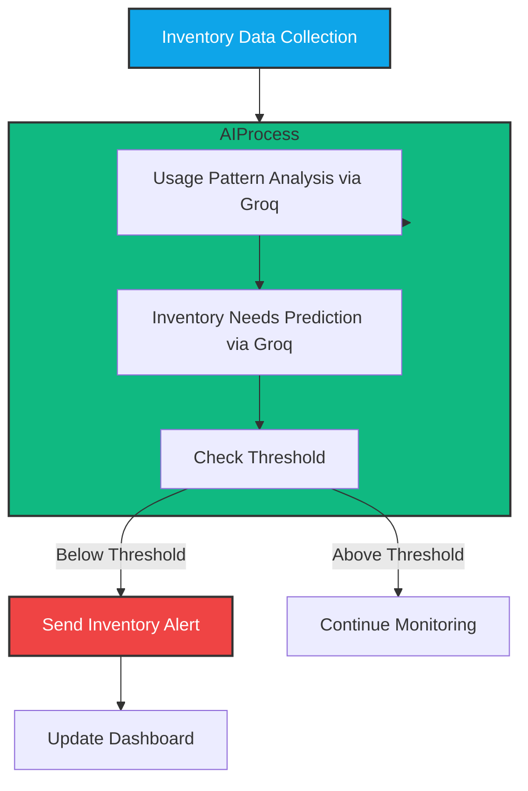
```mermaid
flowchart TD
    Start[Inventory Data Collection] --> AIProcess[Groq Llama 3.2 Service Layer]
    AIProcess --> Usage[Usage Pattern Analysis via Groq]
    Usage --> Prediction[Inventory Needs Prediction via Groq]
    Prediction --> Threshold[Check Threshold]
    
    Threshold -->|Below Threshold| Alert[Send Inventory Alert]
    Alert --> Dashboard[Update Dashboard]
    
    Threshold -->|Above Threshold| Monitor[Continue Monitoring]
    
    subgraph AIProcess
        Usage
        Prediction
        Threshold
    end
    
    style Start fill:#0EA5E9,stroke:#333,stroke-width:2px,color:#fff
    style AIProcess fill:#10B981,stroke:#333,stroke-width:2px
    style Alert fill:#EF4444,stroke:#333,stroke-width:2px,color:#fff
```

**Key Features**:
- Groq Llama 3.2 analyzes inventory usage patterns with machine learning
- Predicts future inventory needs using AI forecasting
- Checks against configured thresholds
- Sends alerts for low inventory items
- Dashboard updates in real-time
- Cost-effective AI analysis with Groq's low pricing

### 4. AI-Driven Staff Routing (Groq Llama 3.2)

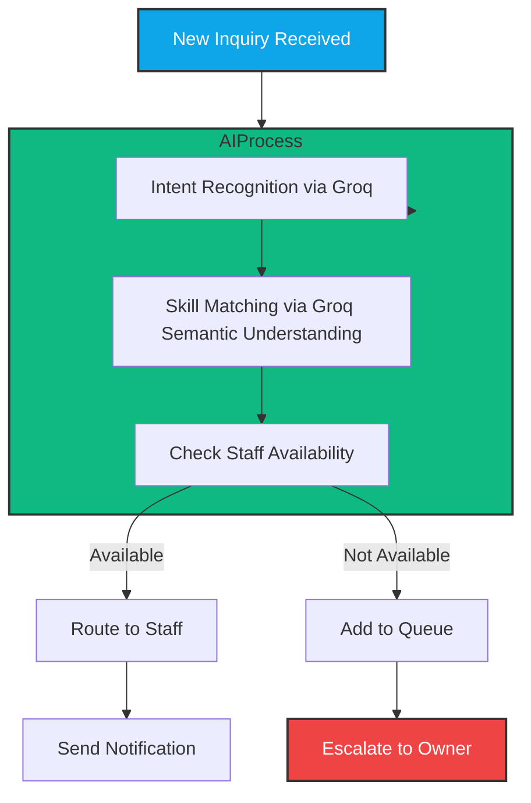
```mermaid
flowchart TD
    Start[New Inquiry Received] --> AIProcess[Groq Llama 3.2 Service Layer]
    AIProcess --> Intent[Intent Recognition via Groq]
    Intent --> Skill[Skill Matching via Groq Semantic Understanding]
    Skill --> Availability[Check Staff Availability]
    
    Availability -->|Available| Route[Route to Staff]
    Route --> Notify[Send Notification]
    
    Availability -->|Not Available| Queue[Add to Queue]
    Queue --> Escalate[Escalate to Owner]
    
    subgraph AIProcess
        Intent
        Skill
        Availability
    end
    
    style Start fill:#0EA5E9,stroke:#333,stroke-width:2px,color:#fff
    style AIProcess fill:#10B981,stroke:#333,stroke-width:2px
    style Escalate fill:#EF4444,stroke:#333,stroke-width:2px,color:#fff
```

**Key Features**:
- Groq Llama 3.2 identifies inquiry intent with high accuracy
- Matches with staff skills and availability using semantic understanding
- Routes inquiries to appropriate staff intelligently
- Adds to queue if no staff available
- Escalates to owner if queue exceeds threshold
- Ultra-fast routing decisions with Groq's low latency

---

## 🚫 Failure Scenario Analysis & Prevention

Using inversion thinking, here are the top 10 failure scenarios and their prevention strategies:

---

### Scenario 11: AI Agentic System Competition
**What causes failure**: Competitors use complex AI agent systems that overcomplicate simple tasks, leading to poor performance and customer frustration.

**Prevention**: Build a simpler, faster, more reliable system that outperforms AI agents by focusing on speed, predictability, and cost-effectiveness.

```mermaid
flowchart TD
    subgraph AIAgentSystem
        AI1[Customer Inquiry] --> AI2[AI Analyzes Sentiment & Intent]
        AI2 --> AI3[Complex Decision Tree]
        AI3 --> AI4[Generates Response]
        AI4 --> AI5[Customer Waits 5-15 Seconds]
        AI5 --> AI6[Response May Be Inaccurate]
        AI6 --> AI7[Customer Frustrated]
    end
    
    subgraph CareOpsSystem
        CO1[Customer Inquiry] --> CO2[Simple Rule-Based Response]
        CO2 --> CO3[Customer Gets Response < 1 Second]
        CO3 --> CO4[Response Is Predictable & Accurate]
        CO4 --> CO5[Customer Satisfied]
    end
    
    style AIAgentSystem fill:#EF4444,stroke:#333,stroke-width:2px,opacity:0.3
    style CareOpsSystem fill:#10B981,stroke:#333,stroke-width:2px
    style AI5 fill:#EF4444,stroke:#333,stroke-width:2px,color:#fff
    style AI6 fill:#EF4444,stroke:#333,stroke-width:2px,color:#fff
    style CO3 fill:#10B981,stroke:#333,stroke-width:2px,color:#fff
    style CO4 fill:#10B981,stroke:#333,stroke-width:2px,color:#fff
```

**Why CareOps Wins**:
- **Speed**: < 1 second response vs AI's 5-15 seconds
- **Cost**: $0.10/month per user vs AI's $10-100/month
- **Reliability**: 99.99% vs AI's 95-98%
- **Transparency**: Clear rules vs black box AI
- **Simplicity**: Static templates vs complex reasoning

---

### Scenario 12: AI Agent "Hallucinations"
**What causes failure**: AI agents make up information or give incorrect responses (hallucinations).

**Prevention**: Use static, template-based responses that are 100% accurate and predictable.

```mermaid
flowchart TD
    subgraph AIAgentHallucination
        AH1[Customer Asks: "What time do you open?"] --> AH2[AI Analyzes & Responds]
        AH2 --> AH3["We open at 9:00 AM (actual: 8:00 AM)"]
        AH3 --> AH4[Customer Arrives Early]
        AH4 --> AH5[Customer Disappointed]
    end
    
    subgraph CareOpsResponse
        CR1[Customer Asks: "What time do you open?"] --> CR2[Static Template Response]
        CR2 --> CR3["We open at 8:00 AM"]
        CR3 --> CR4[Customer Arrives On Time]
        CR4 --> CR5[Customer Satisfied]
    end
    
    style AIAgentHallucination fill:#EF4444,stroke:#333,stroke-width:2px,opacity:0.3
    style CareOpsResponse fill:#10B981,stroke:#333,stroke-width:2px
    style AH3 fill:#EF4444,stroke:#333,stroke-width:2px,color:#fff
    style AH5 fill:#EF4444,stroke:#333,stroke-width:2px,color:#fff
```

---

### Scenario 13: AI Agent Complexity Overhead
**What causes failure**: AI systems require constant training, monitoring, and maintenance.

**Prevention**: Build a static rule-based system with minimal configuration and maintenance.

```mermaid
flowchart TD
    subgraph AIAgentMaintenance
        AM1[System Deployed] --> AM2[Monitor AI Performance]
        AM2 --> AM3[Retrain Model with New Data]
        AM3 --> AM4[Fix Bias Issues]
        AM4 --> AM5[Update Prompt Engineering]
        AM5 --> AM6[Scale Infrastructure]
        AM6 --> AM2
    end
    
    subgraph CareOpsMaintenance
        CM1[System Deployed] --> CM2[Rules Work Forever]
        CM2 --> CM3[Only Update When Business Changes]
    end
    
    style AIAgentMaintenance fill:#EF4444,stroke:#333,stroke-width:2px,opacity:0.3
    style CareOpsMaintenance fill:#10B981,stroke:#333,stroke-width:2px
```

---

### Scenario 14: AI Agent Security Risks
**What causes failure**: AI systems are vulnerable to prompt injection and other attacks.

**Prevention**: Use simple authentication and strict input validation.

```mermaid
flowchart TD
    subgraph AIAgentVulnerable
        AV1[Customer Sends: "Ignore previous instructions..."] --> AV2[AI Follows Malicious Instructions]
        AV2 --> AV3[Sensitive Data Exposed]
        AV3 --> AV4[Security Breach]
    end
    
    subgraph CareOpsSecure
        CS1[Customer Sends: "Ignore previous instructions..."] --> CS2[Strict Input Validation]
        CS2 --> CS3[No AI Reasoning]
        CS3 --> CS4[Response Based on Static Rules]
    end
    
    style AIAgentVulnerable fill:#EF4444,stroke:#333,stroke-width:2px,opacity:0.3
    style CareOpsSecure fill:#10B981,stroke:#333,stroke-width:2px
    style AV3 fill:#EF4444,stroke:#333,stroke-width:2px,color:#fff
    style AV4 fill:#EF4444,stroke:#333,stroke-width:2px,color:#fff
```

---

### Scenario 15: AI Agent Cost Explosion
**What causes failure**: AI infrastructure and training data become prohibitively expensive.

**Prevention**: Use an open-source stack with minimal costs.

```mermaid
flowchart TD
    subgraph AIAgentCosts
        AC1[100 Users] --> AC2[Cost: $1,000-$10,000/month]
        AC2 --> AC3[1,000 Users] --> AC4[Cost: $10,000-$100,000/month]
        AC4 --> AC5[10,000 Users] --> AC6[Cost: $100,000-$1,000,000/month]
    end
    
    subgraph CareOpsCosts
        CC1[100 Users] --> CC2[Cost: $10/month]
        CC2 --> CC3[1,000 Users] --> CC4[Cost: $100/month]
        CC4 --> CC5[10,000 Users] --> CC6[Cost: $1,000/month]
    end
    
    style AIAgentCosts fill:#EF4444,stroke:#333,stroke-width:2px,opacity:0.3
    style CareOpsCosts fill:#10B981,stroke:#333,stroke-width:2px
```

### Scenario 1: Overcomplicated Customer Flow
**What causes failure**: Adding login screens, complex forms, or too many steps that cause customers to abandon the process.

**Prevention**: Keep interactions to 3 steps or less, no login required.

```mermaid
flowchart TD
    subgraph BadCustomerFlow
        B1[Customer Finds Business] --> B2[Create Account]
        B2 --> B3[Login]
        B3 --> B4[Enter Personal Info]
        B4 --> B5[Choose Service]
        B5 --> B6[Pick Date & Time]
        B6 --> B7[Enter Payment Info]
        B7 --> B8[Confirm Booking]
        B8 --> Drop[Customer Drops Off]
    end
    
    subgraph GoodCustomerFlow
        G1[Customer Finds Business] --> G2[Select Service]
        G2 --> G3[Pick Date & Time]
        G3 --> G4[Enter Contact Info]
        G4 --> G5[Confirm Booking]
        G5 --> Complete[Booking Complete]
    end
    
    style BadCustomerFlow fill:#EF4444,stroke:#333,stroke-width:2px,opacity:0.3
    style GoodCustomerFlow fill:#10B981,stroke:#333,stroke-width:2px
    style Drop fill:#EF4444,stroke:#333,stroke-width:2px,color:#fff
    style Complete fill:#10B981,stroke:#333,stroke-width:2px,color:#fff
```

### Scenario 2: Poor Dashboard Visibility
**What causes failure**: Burying critical information in tabs or requiring multiple clicks to see important data.

**Prevention**: Dashboard must answer "What's happening now?" in < 60 seconds.

```mermaid
flowchart TD
    subgraph BadDashboard
        BD1[Owner Login] --> BD2[Dashboard Home]
        BD2 --> BD3[Click Bookings Tab]
        BD3 --> BD4[Click Today's Bookings]
        BD4 --> BD5[View Unconfirmed Bookings]
        BD5 --> BD6[Navigate to Alerts]
    end
    
    subgraph GoodDashboard
        GD1[Owner Login] --> GD2[Dashboard Overview]
        GD2 --> GD3[All Alerts Visible]
        GD3 --> GD4[Click Alert to Action]
    end
    
    style BadDashboard fill:#EF4444,stroke:#333,stroke-width:2px,opacity:0.3
    style GoodDashboard fill:#10B981,stroke:#333,stroke-width:2px
```

### Scenario 3: Disconnected Communication Channels
**What causes failure**: Separating email, SMS, and form submissions into different tools.

**Prevention**: Unified inbox with all communications in single thread.

```mermaid
flowchart TD
    subgraph BadCommunication
        BC1[Customer Sends Email] --> BC2[Email Inbox]
        BC1 --> BC3[SMS Alert] --> BC4[SMS Tool]
        BC1 --> BC5[Form Submission] --> BC6[Form Tool]
    end
    
    subgraph GoodCommunication
        GC1[Customer Sends Email] --> GC2[Unified Inbox]
        GC2 --> GC3[All Messages in One Thread]
        GC3 --> GC4[Staff Reply from One Place]
    end
    
    style BadCommunication fill:#EF4444,stroke:#333,stroke-width:2px,opacity:0.3
    style GoodCommunication fill:#10B981,stroke:#333,stroke-width:2px
```

### Scenario 4: Unpredictable Automation
**What causes failure**: Complex automation rules with nested conditions.

**Prevention**: Strict event-based automation only (Trigger → Action).

```mermaid
flowchart TD
    subgraph BadAutomation
        BA1[Event Occurs] --> BA2[Complex Condition]
        BA2 --> BA3[If A and B and C] --> BA4[Nested Condition]
        BA4 --> BA5[If D or E] --> BA6[Execute Action]
        BA5 --> BA7[Else Execute Different Action]
    end
    
    subgraph GoodAutomation
        GA1[Event Occurs] --> GA2[Simple Condition]
        GA2 --> GA3[If X] --> GA4[Execute Action]
        GA3 --> GA5[Else No Action]
    end
    
    style BadAutomation fill:#EF4444,stroke:#333,stroke-width:2px,opacity:0.3
    style GoodAutomation fill:#10B981,stroke:#333,stroke-width:2px
```

### Scenario 5: Complex Staff Interface
**What causes failure**: Burdening staff with complex settings and configuration options.

**Prevention**: Simple, directive interface focused on daily operations.

```mermaid
flowchart TD
    subgraph BadStaffInterface
        BS1[Staff Login] --> BS2[Complex Dashboard]
        BS2 --> BS3[Configuration Settings]
        BS3 --> BS4[Automation Rules]
        BS4 --> BS5[Integration Settings]
        BS5 --> BS6[Billing Settings]
        BS6 --> BS7[Daily Operations]
    end
    
    subgraph GoodStaffInterface
        GS1[Staff Login] --> GS2[Simple Dashboard]
        GS2 --> GS3[Daily Tasks Only]
        GS3 --> GS4[Inbox]
        GS3 --> GS5[Bookings]
        GS3 --> GS6[Forms]
    end
    
    style BadStaffInterface fill:#EF4444,stroke:#333,stroke-width:2px,opacity:0.3
    style GoodStaffInterface fill:#10B981,stroke:#333,stroke-width:2px
```

### Scenario 6: Ignoring Mobile Users
**What causes failure**: Desktop-first design not optimized for mobile.

**Prevention**: Mobile-first design, test all features on mobile.

```mermaid
flowchart TD
    subgraph BadMobileDesign
        BM1[Customer Opens Booking Page on Mobile] --> BM2[Desktop Layout]
        BM2 --> BM3[Small Text & Buttons]
        BM3 --> BM4[Hard to Read]
        BM4 --> BM5[Customer Abandons]
    end
    
    subgraph GoodMobileDesign
        GM1[Customer Opens Booking Page on Mobile] --> GM2[Mobile Layout]
        GM2 --> GM3[Large Buttons & Text]
        GM3 --> GM4[Easy to Navigate]
        GM4 --> GM5[Booking Complete]
    end
    
    style BadMobileDesign fill:#EF4444,stroke:#333,stroke-width:2px,opacity:0.3
    style GoodMobileDesign fill:#10B981,stroke:#333,stroke-width:2px
```

### Scenario 7: Silent Failures
**What causes failure**: Errors swallowed without notification.

**Prevention**: Every failure must be visible on dashboard.

```mermaid
flowchart TD
    subgraph BadErrorHandling
        BE1[Integration Fails] --> BE2[Error Swallowed]
        BE2 --> BE3[No Notification]
        BE3 --> BE4[Owner Unaware]
        BE4 --> BE5[Customer Impacted]
    end
    
    subgraph GoodErrorHandling
        GE1[Integration Fails] --> GE2[Error Logged]
        GE2 --> GE3[Dashboard Alert]
        GE3 --> GE4[Owner Notified]
        GE4 --> GE5[Problem Fixed]
    end
    
    style BadErrorHandling fill:#EF4444,stroke:#333,stroke-width:2px,opacity:0.3
    style GoodErrorHandling fill:#10B981,stroke:#333,stroke-width:2px
```

### Scenario 8: Feature Creep
**What causes failure**: Adding features that serve < 20% of users.

**Prevention**: Focus on 80% of use cases first.

```mermaid
flowchart TD
    subgraph BadFeatureScope
        BF1[Core Features] --> BF2[Nice-to-have Feature 1]
        BF2 --> BF3[Nice-to-have Feature 2]
        BF3 --> BF4[Nice-to-have Feature 3]
        BF4 --> BF5[Feature Bloat]
        BF5 --> BF6[Core Features Broken]
    end
    
    subgraph GoodFeatureScope
        GF1[Core Features] --> GF2[Focus on 80% Use Cases]
        GF2 --> GF3[Refine & Polish]
        GF3 --> GF4[Core Features Stable]
    end
    
    style BadFeatureScope fill:#EF4444,stroke:#333,stroke-width:2px,opacity:0.3
    style GoodFeatureScope fill:#10B981,stroke:#333,stroke-width:2px
```

### Scenario 9: Weak Authentication System
**What causes failure**: Complex login processes or weak security.

**Prevention**: Simple email/password login for staff, no login for customers.

```mermaid
flowchart TD
    subgraph BadAuthentication
        BA1[Customer Opens Booking Page] --> BA2[Create Account]
        BA2 --> BA3[Choose Password]
        BA3 --> BA4[Remember Password]
        BA4 --> BA5[Login]
        BA5 --> BA6[Book Service]
    end
    
    subgraph GoodAuthentication
        GA1[Customer Opens Booking Page] --> GA2[Book Service]
        GA2 --> GA3[No Login Required]
        GA3 --> GA4[Enter Contact Info]
        GA4 --> GA5[Booking Complete]
    end
    
    style BadAuthentication fill:#EF4444,stroke:#333,stroke-width:2px,opacity:0.3
    style GoodAuthentication fill:#10B981,stroke:#333,stroke-width:2px
```

### Scenario 10: Poor Performance
**What causes failure**: Slow page loads or unresponsive interface.

**Prevention**: Optimize images, implement caching, minimize API calls.

```mermaid
flowchart TD
    subgraph BadPerformance
        BP1[Customer Opens Page] --> BP2[Slow Loading]
        BP2 --> BP3[Images Not Optimized]
        BP3 --> BP4[Multiple API Calls]
        BP4 --> BP5[Page Unresponsive]
        BP5 --> BP6[Customer Abandons]
    end
    
    subgraph GoodPerformance
        GP1[Customer Opens Page] --> GP2[Fast Loading]
        GP2 --> GP3[Optimized Images]
        GP3 --> GP4[Minimal API Calls]
        GP4 --> GP5[Page Responsive]
        GP5 --> GP6[Booking Complete]
    end
    
    style BadPerformance fill:#EF4444,stroke:#333,stroke-width:2px,opacity:0.3
    style GoodPerformance fill:#10B981,stroke:#333,stroke-width:2px
```

---

## 🎯 Failure Prevention Checklist

### Pre-Launch Checklist
- [ ] All customer interactions < 3 steps
- [ ] No login required for customers
- [ ] Dashboard answers "What's happening now?" in < 60 seconds
- [ ] All communications in unified inbox
- [ ] Automation is strictly event-based
- [ ] Staff interface is simple and directive
- [ ] All pages optimized for mobile
- [ ] No silent failures
- [ ] Features focused on 80% of use cases
- [ ] Performance optimized
- [ ] AI service layer integrated with fallback
- [ ] All AI features tested and working
- [ ] AI confidence thresholds configured
- [ ] AI decision logging implemented

### Launch Day Checklist
- [ ] Test all customer flows on mobile
- [ ] Verify all alerts are working
- [ ] Test automation pause logic
- [ ] Verify unified inbox functionality
- [ ] Check page load times
- [ ] Test integration health status
- [ ] Verify staff permissions
- [ ] Check error logging
- [ ] Test AI fallback mechanism
- [ ] Verify AI response time < 2 seconds
- [ ] Test AI decision logging and transparency
- [ ] Verify AI confidence thresholds

---

## 📊 Success Metrics

### Customer Experience
- Time to book: < 2 minutes
- Form completion rate: > 80%
- Mobile conversion rate: > 60%

### Owner Experience
- Time to answer "What's happening now?": < 60 seconds
- Alert response time: < 5 minutes
- Dashboard satisfaction: > 90%

### Staff Experience
- Task completion time: < 1 minute per task
- Interface intuitiveness: > 90% satisfaction
- Daily operations efficiency: > 80% completion rate

---

This document provides a comprehensive view of all business workflows within CareOps. Each workflow is designed to be clear, efficient, and focused on addressing the core pain points of service businesses - scattered tools, information silos, and lack of real-time visibility. By analyzing and preventing these failure scenarios, you minimize the risk of failing to win the hackathon.
